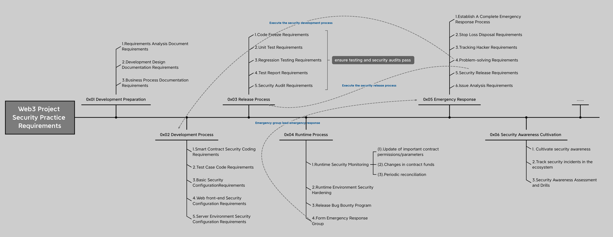

# Web3 Project Security Practice Requirements v0.1

[中文版本](./README_zh_CN.md), 
[日本語版](./README_ja_JP.md)

## 0x00 Background Overview

At present, attacks against Web3 projects emerge in an endless stream, and the interactions between projects are becoming more and more complex. The interaction between various projects often introduces new security issues, and most Web3 development teams generally lack experience in cutting-edge security attack and defense.while in the development of Web3 projects, the focus is on the business demonstration of the project and the realization of business functions, and there is no more energy to complete the construction of the security system. Therefore, in the absence of a security system, it is difficult to ensure the security of a Web3 project throughout its life cycle.

Usually, the project team will find an excellent blockchain security team to conduct security audits on its code in order to ensure the security of Web3 projects. When conducting security audits, various security practice requirements can be better achieved, but blockchain security the team's audit is only a short-term guidance, and does not allow the project team to establish its own security system.

Therefore, the SlowMist security team has open-sourced **`Web3 Project Security Practice Requirements`** to continuously help the project team in the blockchain ecosystem to master the corresponding Web3 project security skills, It is hoped that the project team can establish and improve its own security system based on **`Web3 Project Security Practice Requirements`**, and also have certain security capabilities after security audits.

`Web3 Project Security Practice Requirements` contains the following content, which is currently in the v0.1 version and is still being improved. If you have better suggestions, please submit feedback. (If you need help please contact `team@slowmist.com`, `sec_audit@slowmist.com`)

## 0x01 Development Preparation

### 1.Requirements Analysis Document Requirements

- Make sure to include a thorough description of the project;
- Make sure to include the specific problem that the project is to address;
- Make sure to include a security/privacy risk assessment;

### 2.Development Design Documentation Requirements

- Make sure to include the project's architectural design diagram;
- Make sure to include functional descriptions of functions in the code;
- Make sure to include a description of the relationship between the contracts in the code;
- Make sure to include security/privacy requirements;

### 3.Business Process Documentation Requirements

- Make sure to include a description of each business process in the project;
- Make sure to include a detailed business process diagram;
- Make sure to include a detailed funding link diagram;

## 0x02 Development Process

### 1.Smart Contract Security Coding Requirements

- Make sure to develop based on well-known libraries such as: OpenZeppelin as much as possible;
- Make sure to include a compiler that uses SafeMath or a compiler version above 0.8.x to prevent most overflow issues;
- Make sure to follow function naming conventions, see: [solidity style guide](https://docs.soliditylang.org/en/v0.8.14/style-guide.html);
- Make sure that function and variable visibility are explicitly declared;
- Make sure that the function return value is explicitly assigned;
- Make sure that functions and parameters are well-annotated;
- Make sure that external calls correctly check the return value, including: transfer, transferFrom, send, call, delegatecall, etc;
- Make sure that the implementation of the parameter type and return value of the interface is correct;
- Make sure that the key parameters of the contract are set up with authentication and use events to record;
- Make sure that the data structure of the new implementation contract of the upgradeable model is compatible with the data structure of the old implementation contract;
- Make sure that the logic involved in arithmetic operations in the code fully considers the precision problem, and avoids the problem of possible loss of precision caused by dividing and then multiplying;
- Make sure that the target address and function of low-level calls such as: call are expected;
- When using low-level calls such as: call, limit Gas according to business needs;
- Coding specifications are constrained, follow: first judge, then write variables, and then make external calls (Checks-Effects-Interactions);
- Make sure that external contracts that interact in business are compatible with each other, such as: deflation/inflation tokens, reentrant tokens such as: ERC-777, ERC-677, ERC-721, see: [Reentrancy Vulnerability Case](https://medium.com/amber-group/preventing-re-entrancy-attacks-lessons-from-history-c2d96480fac3);
- Make sure that external calls fully consider the risk of reentrancy;
- Avoid using a lot of loops to assign/read the contract's storage variable;
- Avoid the problem of excessive concentration of authority as much as possible, especially the authority to modify the key parameters of the contract, separate authority, and use governance, timelock contract or multi-signature contract to manage as much as possible;
- The inheritance relationship of contracts should maintain linear inheritance, and ensure that the inherited contracts are really needed for business;
- Avoid using on-chain block data as a seed source for random;
- Make sure that the acquisition and use of random numbers fully consider the possibility of rollback attacks;
- Use Chainlink's VRF to obtain reliable random, see: [Chainlink VRF](https://docs.chain.link/docs/chainlink-vrf/);
- Avoid using the token quantity of the third-party contract to directly calculate the LP Token price, see: [How to get the price of LP correctly](https://blog.alphafinance.io/fair-lp-token-pricing/);
- Avoid a single price source when obtaining prices through third-party contracts. It is recommended to use at least 3 price sources;
- Use events as far as possible in key business processes to record the status of execution for data analysis when the project is running;
- Reserve the switch for an emergency suspension of the global and core business, so that it is convenient to stop losses in time when a black swan event occurs;

### 2.Test Case Code Requirements

- Make sure to include business process/function functional usability testing;
- Make sure that the unit test coverage rate is more than 95%, and the core code coverage rate must reach 100%;

### 3. Basic Security Configuration Requirements

- Make sure that use of an effective CI/CD Pipeline, see: [CI/CD Pipeline for Smart Contracts](https://docs.tenderly.co/forks/guides/ci-cd-pipeline-for-smart-contracts)；
- Make sure that the official email uses well-known service providers, such as: Gmail;
- Make sure that the official email account opens MFA function;
- Make sure that the use of well-known domain name service providers, such as: GoDaddy;
- Make sure that the use of excellent CDN service providers, such as: Akamai and Cloudflare;
- Make sure that DNS configuration turns on DNSSec, set a strong password for the management account on the domain name service management platform, and turn on MFA authentication;
- Make sure that DNS resolution uses excellent domain name service providers, such as: GoDaddy, NameSilo, NameCheap, etc.
- Make sure that domain privacy protection is turned on; 
- Make sure that all mobile phones and computer devices use anti-virus software, such as: Kaspersky, AVG, etc;

### 4. Web front-end Security Configuration Requirements

- Make sure that the HTTP communication of the whole site adopts HTTPS;
- Make sure HSTS is configured to prevent man-in-the-middle attacks like: DNS hijacking, BGP hijacking,see：[HSTS Configuration Introduction](https://developer.mozilla.org/en-US/docs/Web/HTTP/Headers/Strict-Transport-Security);
- Make sure X-FRAME-OPTIONS is configured to prevent Clickjacking attacks, see: [X-FRAME-OPTIONS Configuration Introduction](https://developer.mozilla.org/en-US/docs/Web/HTTP/Headers/X-Frame-Options);
- Make sure X-Content-Type-Options are configured to combat the risks caused by browser sniff behavior, see：[X-Content-Type-Options Configuration Introduction](https://developer.mozilla.org/en-US/docs/Web/HTTP/Headers/X-Content-Type-Options);
- Make sure CSP policies are configured to prevent XSS attacks, see: [CSP Configuration Introduction](https://developer.mozilla.org/en-US/docs/Web/HTTP/CSP);
- Make sure cookies related to permissions and user credentials are configured with HttpOnly, Secure, Expires, SameSite flags, see: [Cookie Configuration Introduction](https://developer.mozilla.org/en-US/docs/Web/HTTP/Cookies);
- Make sure that the sub-domains of different businesses are strictly separated to avoid the XSS problems of the sub-domains affecting each other;
- Make sure that the referenced third-party resources are restricted by the integrity attribute, so as to avoid the third-party being hacked and the project's site from being affected, see：[SRI Configuration Introduction](https://developer.mozilla.org/zh-CN/docs/Web/Security/Subresource_Integrity);
- Make sure CORS is properly configured to only allow the specified origin domain, protocol and port to access the project's resources, see: [CORS Configuration Introduction](https://developer.mozilla.org/zh-CN/docs/Web/HTTP/CORS);
- Make sure that the addEventListener/postMessage implemented in the business has the origin and target of the check message, see：[postMessage Configuration Introduction](https://developer.mozilla.org/zh-CN/docs/Web/API/Window/postMessage);

### 5. Server Environment Security Configuration Requirements
- Make sure that the selection of excellent cloud server providers, such as: AWS, Google Cloud, etc;
- Make sure that the cloud platform management account used by the project uses a strong password and turns on MFA;
- Make sure that the security reinforcement of the server before the project code is deployed to the server, such as: installing HIDS, using SSH Key to log in, setting SSH login alert, setting SSH login google-auth, etc;
- Make sure that the use of professional software monitoring services and server availability, such as: APM and Zabbix;
- Make sure that the use of professional institutions to regularly test the safety of projects, such as: SlowMist, Trail of Bits, etc;
- Make sure that server logs, web access logs, database operation logs, and middleware logs are enabled. Utilize a solution like [splunk](https://www.splunk.com/) for centralized log collection and management;
- Make sure that project servers have network access restrictions in place. Utilize IP whitelists and network segmentation to optimize and regulate the project's network architecture, ensuring network connectivity only between servers required for business operations;

## 0x03 Release Process

A complete security online release process is required, which can be refined by referring to the following content

### 1. Code Freeze Requirements

- The estimated launch time is pushed back 2 days, that is, the code must be frozen and no code changes will be made 2 days before the launch;

### 2. Unit Test Requirements

- Make sure that the unit test coverage rate is above 95%, and the core code coverage rate is 100%;
- Make sure to output coverage reports for unit tests;

### 3.Regression Testing Requirements

- Make sure to output coverage reports for unit tests;

### 4.Test Report Requirements

- 0.5 days before the launch, the development and testing will jointly complete the test report. If the test report is not passed (including unit testing and regression testing), the launch time will be postponed, and the code freezing stage will be re-entered after the development is completed and modified (that is, postponed for at least 2 days);

### 5.Security Audit Requirements

- Create an internal security team. All new code implementations must be code-reviewed by the internal security team. Continuously refine and cultivate the internal security team's competencies, see: [SlowMist-Learning-Roadmap-for-Becoming-a-Smart-Contract-Auditor](https://github.com/slowmist/SlowMist-Learning-Roadmap-for-Becoming-a-Smart-Contract-Auditor);
- Security auditors enter the overall security regression after the code is frozen. If any vulnerability or security risk (serious, high-risk, medium-risk) is found, the launch time will be postponed, and the code will be frozen again after the development and modification are completed (that is, delayed for at least 2 days).
- Security audit requires at least three teams to conduct independent audits, and can use 1 internal team + 2 external teams;

## 0x04 Runtime Process

### 1.Runtime Security Monitoring

- Make sure that the Netlify or Vercel used by the project has audit log or Monitoring turned on;
- Make sure that DNS change monitoring is set up and commercial solutions can be used, such as: [Better Stack] (https://betterstack.com/docs/uptime/uptime-monitor/);

As far as possible through the events triggered in the key business processes to discover the security problems of the project runtime, such as:

- Update of important contract permissions/parameters: monitor the events that the management role changes, and the events that the management role modifies the key parameters of the contract, and promptly discover the possible theft of the private key;
- Changes in contract funds: monitor price changes and changes in contract funds, and timely detect possible attacks such as: flash loans;
- Periodic reconciliation: Periodically reconcile events and transactions on the chain to discover possible business logic problems in a timely manner;

### 2.Runtime environment security hardening

- Make sure the security hardening of the server where the front-end code is located,such as：[Install HIDS](https://www.aliyun.com/product/aegis),Login with SSH Key,[Set SSH login alert](https://medium.com/@alessandrocuda/ssh-login-alerts-with-sendmail-and-pam-3ef53aca1381
  ),[Set up SSH login to google-auth](https://goteleport.com/blog/ssh-2fa-tutorial/
  )  etc;
- Make sure that DNS Sec is enabled in the DNS configuration, set a strong password for the management account on the domain name service management platform and enable 2 authentications;
- Make sure that the cloud platform management account used by the project uses a strong password and has 2 authentications enabled;
- Make sure that two-factor authentication is enabled for improved DNS resolution and other operations;

### 3.Release Bug Bounty Program

- Publish a bug bounty program or enter a well-known bug bounty platform to attract community white hats to escort the project; you can choose: [BugRap](https://bugrap.io/),[code4rena](https://code4rena.com/),[immunefi](https://immunefi.com/);

### 4.Form Emergency Response Group

- Set up a nominal emergency response group and provide contact information to the outside world. The emergency response group is responsible for dealing with problems found by white hats or leading team members to carry out an emergency response when a black swan event occurs;

## 0x05 Emergency Response

### 1.Establish A Complete Emergency Response Process

- Develop a complete emergency response process as much as possible, and deal with black swan events in an orderly manner according to the emergency response process;
- Regularly conduct security emergency response drills, refining procedures to ensure a prompt and accurate response to security incidents, such as: [SEAL Drills](https://twitter.com/samczsun/status/1717243519243636755).

### 2.Stop Loss Disposal Requirements

- According to the scope of the problem and the degree of harm, stop the loss through the emergency pause switch in time;
- Notify community members of black swan events to prevent users from continuing to interact with the project and cause losses;

### 3.Tracking Hacker Requirements

- Quickly analyze the hacker's profitable address, and keep the access log of the PC/Web/server (if there is a Trojan, please keep the Trojan file);
- Take a snapshot of the server and keep the hacked scene in time;
- Contact a professional security team to assist in tracking, such as: [MistTrack ](https://misttrack.io/),[Chainalysis](https://www.chainalysis.com/);

### 4.Problem-solving Requirements

- Discuss the best fixes for the problem with a professional security team;
- Correctly implement the fixed plan and ask a professional security team to verify it;

### 5.Security Release Requirements

- Enforce release process requirements to ensure all code changes are tested and security audited;

### 6.Issue Analysis Requirements

- Disclose autopsy reports and synchronize restoration plans and remedies with community members;
- The autopsy report needs to synchronize the essential cause of the problem, the scope of the problem, the specific loss, the repair of the problem, the tracking of the hacker and other related progress;

## 0x06 Security Awareness Cultivation

### 1.Cultivate security awareness

- Project team members must thoroughly review the [Blockchain Dark Forest Selfguard Handbook](https://darkhandbook.io/) to cultivate a strong security awareness.
- Online security awareness training and testing can be conducted through various websites, such as [Google's Phishing Quiz](https://phishingquiz.withgoogle.com/) and [Phishing.org](https://www.phishing.org/phishing-resources);
- Security awareness training and assessment should be integrated into team management practices. For instance, new hires should undergo security awareness training and testing, and IT personnel should receive additional training and assessment in areas such as code development and system operation security;
- Regularly conduct security awareness training to keep team members informed about the latest hacker attack techniques and related security incidents;

### 2.Track security incidents in the ecosystem

- Follow the updates from Crypto Anti-Scam teams like [ScamSniffer](https://x.com/realScamSniffer) and [Wallet Guard](https://x.com/wallet_guard) to stay informed about the latest phishing attack techniques;
- Stay informed about security incidents within the community or ecosystem, compile information, and share it with team members;

### 3.Security Awareness Assessment and Drills

- Conduct periodic security awareness assessments for team members. Collaborate with reputable security companies to conduct relevant security drills;
- Security awareness assessments for team members can be conducted by simulating hacker attack methods, such as phishing or Trojan horse attacks. This not only evaluates team members' security awareness but also verifies the detection capabilities of endpoint security protection systems on their devices;